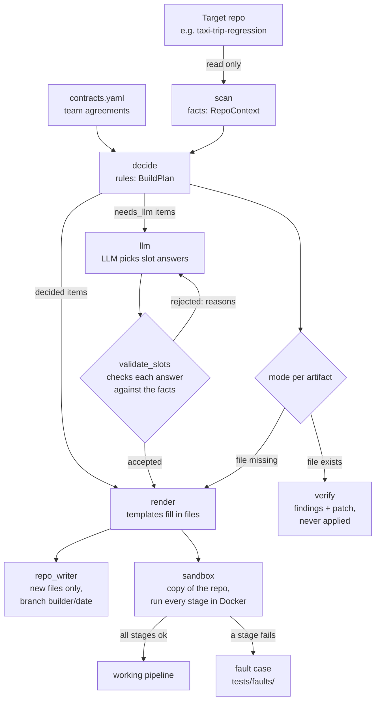

# How the Builder works

A plain-language guide to this repository, for explaining it to someone who hasn't read the code.
Every claim below points to a file you can open. Status as of 2026-10-09.

## 1. What the Builder is, and the problem it solves

The project (ADSP Topic 4) is a team of six **agents**: small programs that each watch one part of
a machine-learning system and act on it. The team design is in `docs/architecture.html`.

The **Builder** is the first agent. Its job: take an existing Python machine-learning repository
(a "repo": a project folder tracked by git) and give it a working **pipeline**, meaning the
commands and files that install it, train the model, evaluate it and serve it as a web service.

Today a data scientist writes these files by hand:

- **Makefile**: a list of named commands (`make train`, `make test`, …).
- **Dockerfile**: a recipe for a **container image**, a sealed package with the code and everything
  it needs to run. A running image is a **container**.
- **docker-compose file**: starts several containers together (the model service, MLflow, …).
- **CI workflow**: a file that tells GitHub to run checks automatically on every change
  (CI = continuous integration).
- **MLflow**: a server that records training runs and stores trained models.

Writing these by hand is slow and error-prone. In our reference runs (section 6) small mistakes in
exactly these files broke the whole stack. The Builder reads the repo, decides what is needed,
generates the files, and checks them by actually running them in a throwaway copy.

The rules it follows are in `CLAUDE.md`. The team's shared agreements (ports, paths, the API format)
are in `contracts.yaml`.

## 2. The flow: from repo to working pipeline

In words:

1. **scan** reads the repo without running any of its code and writes down facts.
2. **decide** combines those facts with `contracts.yaml` using fixed rules. What the rules can't
   settle is marked `needs_llm`.
3. For `needs_llm` items, the **LLM** (a large language model, a text-generating AI) chooses
   answers from lists the scanner prepared. The **validator** checks every answer; a rejected
   answer goes back to the LLM with the reasons.
4. **render** fills **templates** (text files with blanks) to produce the pipeline files.
5. Each artifact is either created (it doesn't exist yet) or **verified** (it exists, so the Builder
   only reports problems and proposes fixes).
6. **repo_writer** is the only part allowed to write into a target repo, and it only adds new files.
7. The **sandbox** runs the whole pipeline in a temporary copy to prove it works.

## 3. The folders of `builder_agent/`

**`scan/`**: the repo reader. *In:* a folder path. *Out:* a `RepoContext` (a structured record of
facts) and a short text summary for the LLM. It parses Python with the **AST** (the code's
structure tree, read without running it) to find imports, entry points (train/predict/serve
scripts), web apps and ports, data and model folders, notebooks, Git LFS files (large files stored
outside git), target columns, the transform applied to the target, and which rows two data files
share. *Key function:* `scan_repo()` in `scan/__init__.py`. Command: `python -m builder_agent.scan <repo>`.

**`decide/`**: the rule engine, no LLM. *In:* `RepoContext` + `contracts.yaml`. *Out:* a `BuildPlan`
with the Python version, the install commands, how to serve the model, one command per make target,
and a list of `needs_llm` items with their reasons. `modes.py` decides, per artifact (Dockerfile,
compose, Makefile, CI, agents.yaml, schema draft, contract adapter), "create" or "verify".
*Key functions:* `plan_build()` in `decide/__init__.py`, `select_modes()` in `decide/modes.py`.

**`render/`**: the file generator. *In:* the plan, the **slot answers** (the few choices the LLM
makes, section 5), `contracts.yaml`. *Out:* the adapter scripts in `pipeline/` (train, evaluate,
serve, data, smoke test, sample request) and the config files (Dockerfile, .dockerignore, Makefile,
compose.base.yml). `slots.py` holds the answer model, the candidate lists and the validator. Output
is checked with **pyflakes** (finds undefined names and unused imports in Python). *Key functions:*
`render_adapters()`, `render_configs()`, `validate_slots()`. A CI-workflow template (`ci.py`,
checked with **actionlint**, a GitHub-workflow checker) is built but not committed yet (section 7).

**`sandbox/`**: the test run. *In:* a repo path and slot answers. *Out:* a result per stage
(ok/failed/skipped, duration, last 50 lines of output) and a line in `logs/sandbox_attempts.jsonl`.
It copies the repo to a temporary folder (the real data is mounted read-only, never copied), renders
everything there, and runs: render, build, mlflow, data, train, evaluate, serve, health, predict,
stopping at the first failure. *Key function:* `run_sandbox()`.

**`llm/`**: the LLM loop. *In:* a prompt file (`prompts/slots_v1.md`, `slots_v2.md`), the plan's
`needs_llm` items, the candidate lists. *Out:* validated slot answers, and one log line per call in
`logs/llm_calls.jsonl`. It calls a local model through **Ollama** (a program that runs open models
on your own machine), makes at most 3 attempts, and `eval.py` scores answers against hand-made gold
answers. *Key functions:* `fill_slots()`, `run_eval()`.

**`verify/`**: the checker for files that already exist. *In:* a repo and a git commit. *Out:*
`findings.json`, `findings.md` and `fixes.patch` (a **patch**/**diff** lists line-by-line changes).
One rule per fault case (section 6). Read-only on the target; the patch is tested against a clean
export of the commit and never applied. *Key function:* `verify_repo()`. Command:
`python -m builder_agent.verify <repo> --ref HEAD`.

**`repo_writer.py`**: the only door into a target repo. *In:* a set of new files. *Out:* those
files written, or nothing at all if any of them already exists. In a git repo it first creates a
new branch `builder/<date>` (a **branch** is a separate line of work, so `main` is never touched).
*Key class:* `RepoWriter`.

## 4. Where the LLM is used

**Today: one place, slot filling** (`llm/`). The model is `qwen2.5-coder:7b`, run locally with Ollama,
temperature 0 (always picks the most likely word), seed 42, context 8192 tokens (a **token** is
roughly a word piece). It answers eleven questions about the repo, for example which column is the
target, which existing function trains the model, which data file to train on. It may only pick
values from lists the scanner built, and its answer must match a fixed JSON schema.

There was also a one-off experiment (`experiments/llm_spike.py`, section 6) where the LLM wrote whole
files. That approach was dropped.

**Planned** (`docs/ROADMAP.md`, `CLAUDE.md`):

- Diagnosing sandbox failures and choosing a fix from a menu, at most 3 fixes, each verified.
- Filling the CI decisions the rules leave open (`needs_llm` in the CI template), such as which tests
  need running services and which values the compose variables should get in CI.
- A memory of past fixes to search (RAG: retrieving similar past cases before answering), comparing
  search methods.
- Prompt versions (v3, more feedback, runs at temperature 0.7 to measure variation), fine-tuning a
  small model on logged decisions, and DPO (training on pairs of good/bad answers from sandbox
  pass/fail).

## 5. The main design decisions, and why

**Slots instead of free code.** In the spike (`docs/llm-spike-1.md`) the LLM wrote two whole files.
Both parsed as valid Python, but neither would have worked: missing imports, a guessed column name,
and one silent error, a dropped inverse transform that made the service answer in log scale (about
6.3 instead of 531 seconds) while still returning HTTP 200. So now the code comes from tested
templates, and the LLM only fills small blanks ("slots") by choosing from lists. A wrong choice is
easy to detect; a wrong line of free code is not.

**The validator** (`render/slots.py`, `validate_slots()`). Every slot answer is checked against the
scanner's facts before anything is rendered: the target column must be in the data file's header,
the training function must exist and its parameters must be mapped, data paths must use tokens (so
`SAMPLE=1` works), the model's input type must fit the API the training function uses, and the
evaluation file must not share rows with the training file. It returns reasons instead of crashing,
so the reasons can go back to the LLM. Strict typing means "yes" is not accepted as `true`.

**The sandbox** (`sandbox/`). Checking files on paper isn't enough: the first sandbox run on the taxi
repo failed at the train stage because of a version mismatch nobody had predicted (fault case 001).
The sandbox runs the real pipeline on 1% of the data in a throwaway copy, with no host ports and the
data mounted read-only, and stops at the first failing stage.

**The hard rule on existing files** (`repo_writer.py`, `tests/test_repo_rule.py`). The Builder never
changes a file that already exists in a team repo; teammates' work is never overwritten. It only adds
new files, on its own branch, and for problems in existing files it writes a report and a patch that
a person can review. A test fails if any Builder run changes an existing file, and another fails if
any new module writes files without going through `repo_writer.py`.

**contracts.yaml.** Decisions that matter to the whole team (port 8000, `/predict` and `/health`,
the `prediction` field, the MLflow address and experiment name, folder paths) live in one file, not
in the code. The Builder reads it, so changing a team decision means changing one line.

## 6. Results so far

**Reference runs by hand** (no Builder): `docs/reference-run-taxi.md` and `docs/reference-run-main.md`.
The main project's run worked end to end (build 326 s, peak memory 8.39 GiB of 9.71 GiB) and found the
problems that became fault cases 002–006.

**The spike** (`docs/llm-spike-1.md`): 10 problems in two LLM-written files, including 3 undefined
names and the silent log-scale bug. Conclusion: slots, pyflakes, and a smoke test that compares a
known prediction.

**Slot-filling evals** (`experiments/evals/`, 11 slots, compared with `tests/gold/taxi_slots.json`):

| Run | Correct (strict / lenient) | Valid at the end | Attempts | Tokens | End to end |
|---|---|---|---|---|---|
| v1, original system | 8 / 9 | yes (but it would have broken: wrong input type, literal path) | 3 | 8 836 | not run |
| v1, fixed system | 8 / 9 | no (validator caught the problems) | 3 | 9 049 | not run |
| v2, fixed system | 9 / 10 | yes | 2 | 5 889 | all stages ok, 410 s |
| v2, better feedback (5 runs) | 9 / 10 every run | yes, 5/5 | 2 | 6 047 | 5/5 ok, 410 s |

"Lenient" also accepts listed alternatives (training on `train.csv` instead of `train_large.csv`).
The v2 prompt helped most: the parameter mapping became right, probably thanks to its worked example
(no eval isolates that change). The five v2 runs gave the
same answer every time, because at temperature 0 the seed changes nothing. The remaining strict miss
is the evaluation file (`validation.csv` instead of `test.csv`).

**Fault cases** (`tests/faults/*/case.json`, each with the real error output, the cause, the fix and
how to reproduce it; all six could be caught before running anything):

| Id | What broke | Fix |
|---|---|---|
| 001 | MLflow client 3.x can't save models to a 2.17.2 server | pin the client to the server's version |
| 002 | `localstack:stable` now needs an account and exits | pin `4.12` |
| 003 | `postgres:latest` (18) refuses the old data folder mount | pin `16` |
| 004 | Windows line endings break `init.sh` | check out with LF, `.gitattributes` |
| 005 | MLflow model files land on one container's disk only | one artifact store served by MLflow |
| 006 | `mlflow` and `flask-app` have no healthcheck | add healthchecks |

**Verify on the main project** (`experiments/verify/mlops-zoomcamp-project/`, original commit
`e157717`): **8 errors and 5 warnings**, covering all five fault cases 002–006, plus Grafana's image
without a version and without a healthcheck. The proposed patch applies cleanly to that commit.

**Tests:** 198 automated tests pass on the committed code (`tests/`).

## 7. What's not done yet

From `docs/ROADMAP.md` and `CLAUDE.md`:

- **CI workflow** (roadmap item 6): the template, the rules and actionlint validation are written and
  tested locally (taxi and the main project both pass actionlint), but not committed yet, and no
  generated workflow has run on GitHub.
- **Complete mode**: today an artifact is either created or verified; generating only the missing
  pieces of a partly done setup isn't built.
- **agents.yaml, the schema draft** (for the Inspector agent) and **the contract adapter** for the
  main project's API (roadmap item 8): its `/predict` takes a batch and has no `/health`, so it
  needs a bridge to the contract.
- **The message board service** in compose.base.yml, once its owner provides it.
- **Scanner extensions** (roadmap item 5): Airflow DAGs as entry points, parquet headers, a target
  computed from two columns (dropoff minus pickup). The scanner should also skip gitignored files.
- **The LLM fix loop**: reading a failed sandbox stage, choosing a fix, retrying (at most 3).
- **Fix memory and model training** (roadmap item 9): RAG over past fixes, fine-tuning, DPO.
- **Proposing patches as pull requests** instead of files; verify only writes them today.
- **The main project as a held-out test**: no prompt has been tuned on it, and the Builder hasn't
  run its full create flow there yet.
